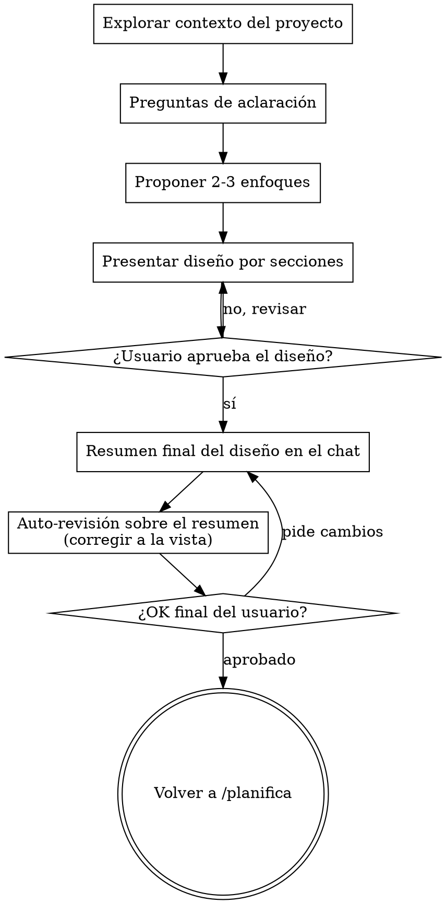

# De Ideas a Diseños (Brainstorming)

Ayuda a convertir ideas en diseños completamente formados mediante un diálogo colaborativo natural.

Empieza entendiendo el contexto actual del proyecto, después haz preguntas de una en una para refinar la idea. Cuando entiendas qué se va a construir, presenta el diseño y consigue la aprobación del usuario.

<PUERTA-DURA>
NO invoques ningún skill de implementación, no escribas contenido final, no montes ningún proyecto ni tomes ninguna acción de implementación hasta que hayas presentado un diseño y el usuario lo haya aprobado. Esto aplica a TODOS los proyectos, da igual lo simples que parezcan.
</PUERTA-DURA>

## Anti-patrón: «Esto es demasiado simple para necesitar un diseño»

Todos los proyectos pasan por este proceso. Una lista de tareas, una utilidad pequeña, un cambio de configuración — todos. Los proyectos «simples» son donde las asunciones sin examinar causan más trabajo tirado a la basura. El diseño puede ser corto (unas pocas frases para proyectos realmente simples), pero DEBES presentarlo y conseguir aprobación.

## Checklist

DEBES crear una tarea por cada uno de estos puntos y completarlos en orden:

1. **Explorar el contexto del proyecto** — revisa archivos, documentos, cambios recientes
2. **Ofrecer el apoyo visual justo-a-tiempo** — NO de entrada. La primera vez que una decisión se entienda genuinamente mejor viéndola que leyéndola, ofrécelo entonces (en su propio mensaje). Si nunca surge una decisión visual, no lo ofrezcas. Ver la sección «Apoyo visual para decidir (artifacts)» más abajo.
3. **Hacer preguntas de aclaración** — de una en una; entender propósito / limitaciones / criterios de éxito
4. **Proponer 2-3 enfoques** — con pros y contras y tu recomendación
5. **Presentar el diseño** — en secciones proporcionadas a su complejidad; aprobación del usuario tras cada sección
6. **Cierre oficial del brainstorming: resumen final del diseño en el chat** — UN solo mensaje consolidado con las conclusiones y decisiones aprobadas (ver abajo). Aquí NO se crea ningún documento.
7. **Auto-revisión sobre ese texto** — huecos, contradicciones, alcance y ambigüedad, sobre el resumen recién escrito; si detectas algo, corrígelo a la vista (ver abajo)
8. **OK final del usuario** — pide la aprobación del resumen antes de continuar
9. **Transición a la planificación** — vuelve a /planifica (el skill que te invocó); el resumen aprobado es la semilla del build plan

## Flujo del proceso

**El estado final es volver a /planifica.** NO invoques ningún skill de implementación. Lo único que viene después del brainstorming es continuar con /planifica (la creación del build plan).

## El Proceso

**Entender la idea:**

- Mira primero el estado actual del proyecto (archivos, documentos, cambios recientes)
- Antes de hacer preguntas de detalle, evalúa el alcance: si la petición describe varios sistemas independientes (p. ej., «montar una plataforma con comunicación a familias, archivo de materiales, pagos y estadísticas»), señálalo inmediatamente. No gastes preguntas refinando detalles de un proyecto que primero hay que trocear.
- Si el proyecto es demasiado grande para un solo build plan, ayuda al usuario a descomponerlo en sub-proyectos: cuáles son las piezas independientes, cómo se relacionan, en qué orden construirlas. Después haz el brainstorming del primer sub-proyecto con el flujo normal. Cada sub-proyecto tiene su propio ciclo de brainstorming → build plan → implementación.
- Para proyectos con el alcance adecuado, haz preguntas de una en una para refinar la idea
- Prefiere preguntas con opciones (tipo test) cuando sea posible, pero las abiertas también valen
- Solo una pregunta por mensaje — si un tema necesita más exploración, divídelo en varias preguntas
- Céntrate en entender: propósito, limitaciones, criterios de éxito

**Explorar enfoques:**

- Propón 2-3 enfoques distintos con sus pros y contras
- Presenta las opciones de forma conversacional, con tu recomendación y el razonamiento
- Empieza por la opción que recomiendas y explica por qué

**Presentar el diseño:**

- Cuando creas que ya entiendes lo que se va a construir, presenta el diseño
- Escala cada sección a su complejidad: unas pocas frases si es sencillo, hasta 200-300 palabras si tiene matices
- Pregunta tras cada sección si de momento va bien encaminado
- Cubre: estructura, componentes, flujo de trabajo, gestión de errores e imprevistos, y cómo se validará que funciona
- Prepárate para volver atrás y aclarar si algo no cuadra

**Diseñar para el aislamiento y la claridad:**

- Divide el sistema en unidades más pequeñas que tengan cada una un propósito claro, se comuniquen mediante puntos de contacto bien definidos, y puedan entenderse y validarse de forma independiente
- Para cada unidad deberías poder responder: qué hace, cómo se usa y de qué depende
- ¿Alguien puede entender qué hace una unidad sin leer sus tripas? ¿Puedes cambiar el interior sin romper a quienes la usan? Si no, los límites necesitan trabajo.
- Las unidades pequeñas y bien delimitadas también son más fáciles para ti — razonas mejor sobre lo que te cabe entero en el contexto, y tus ediciones son más fiables cuando los archivos están enfocados. Cuando un archivo crece mucho, suele ser señal de que hace demasiadas cosas.

**Trabajar en proyectos existentes:**

- Explora la estructura actual antes de proponer cambios. Sigue los patrones existentes.
- Donde lo existente tenga problemas que afecten al trabajo (p. ej., un documento que ha crecido demasiado, límites poco claros, responsabilidades enredadas), incluye mejoras dirigidas como parte del diseño — igual que un buen profesional mejora aquello en lo que trabaja.
- No propongas reorganizaciones no relacionadas. Céntrate en lo que sirve al objetivo actual.

## Después del diseño — cierre oficial del brainstorming

Aquí NO se crea ningún documento. Toda la conversación del brainstorming vive en la memoria de la sesión; lo que hace falta para cerrar en firme es consolidarla a la vista. El objetivo de todo el proceso es el build plan — el diseño aprobado aterrizará allí.

**1. Resumen final del diseño (en el chat):**

- Escribe UN solo mensaje consolidado: «DISEÑO FINAL — [proyecto]», con las conclusiones y decisiones aprobadas en puntos numerados, claro y conciso.
- El acto de consolidar es en sí la re-lectura: al juntar en un solo bloque lo que quedó repartido por una conversación larga es cuando afloran los huecos y las contradicciones.

**2. Auto-revisión sobre ese texto recién escrito:**

1. **Barrido de huecos:** ¿algún «pendiente», «por decidir» o requisito vago?
2. **Coherencia interna:** ¿algún punto contradice a otro?
3. **Comprobación de alcance:** ¿está lo bastante acotado para un solo build plan, o hay que descomponerlo?
4. **Comprobación de ambigüedad:** ¿algún punto puede interpretarse de dos maneras? Si sí, elige una y hazla explícita.

Si detectas algo, corrígelo a la vista: di qué has corregido y reescribe el punto. Si no, dilo en una línea: «Auto-revisión: sin huecos ni contradicciones.»

**3. OK final del usuario:**

> «Este es el diseño final. ¿Lo damos por cerrado y seguimos con el build plan?»

Espera la respuesta. Si pide cambios, corrige el resumen y repite la auto-revisión. Continúa solo cuando el usuario apruebe.

**4. Transición:**

- Vuelve a /planifica para continuar con la creación del build plan. El resumen aprobado es la semilla del build plan — /planifica lo transcribe como su cabecera de diseño.
- NO invoques ningún otro skill. Volver a /planifica es el siguiente paso.

## Principios clave

- **Una pregunta cada vez** — no agobies con varias preguntas a la vez
- **Mejor con opciones** — más fáciles de responder que las abiertas, cuando se pueda
- **Recorta sin piedad lo innecesario** — elimina de todos los diseños las funciones que no hacen falta (principio YAGNI: «no lo vas a necesitar»)
- **Explora alternativas** — propón siempre 2-3 enfoques antes de asentarte en uno
- **Validación incremental** — presenta el diseño y consigue aprobación antes de avanzar
- **Sé flexible** — vuelve atrás y aclara cuando algo no cuadre
- **De tú, en singular** — nunca «vosotros», aunque haya más de una persona delante; te diriges a quien escribe

## Apoyo visual para decidir (artifacts)

Para decisiones difíciles durante la planificación puedes crear un artifact — una página visual tipo infografía (maquetas, diagramas, comparativas de opciones lado a lado) que se abre en el navegador. Es una herramienta, no un modo: aceptarla significa que está disponible para las preguntas que se beneficien de un tratamiento visual; NO significa que todas las preguntas pasen por el navegador.

**Ofrecerlo (justo-a-tiempo):** NO lo ofrezcas de entrada. Espera a que una decisión se entienda genuinamente mejor viéndola que leyéndola — una maqueta real, una comparativa de estructuras u opciones, un diagrama de flujo o de fases; no simplemente un *tema* visual. La primera vez que ocurra, ofrécelo entonces, en su propio mensaje:

> «Esta parte igual es más fácil si te la enseño — puedo montar una infografía con las opciones comparadas y abrírtela en el navegador. ¿Quieres?»

**Este ofrecimiento DEBE ir en su propio mensaje.** Solo el ofrecimiento — sin pregunta de aclaración, resumen ni otro contenido. Espera la respuesta. Si acepta: carga primero el skill `artifact-design` (viene de serie con Claude Code), crea la página con la herramienta Artifact y ábresela en el navegador. Si declina, continúa solo con texto y no lo vuelvas a ofrecer salvo que lo pida el usuario.

**Decisión por pregunta:** Incluso después de que el usuario acepte, decide PARA CADA PREGUNTA si usar el artifact o el chat. El test: **¿el usuario entenderá esto mejor viéndolo que leyéndolo?**

- **Usa el artifact** para contenido que ES visual — maquetas, comparativas de opciones o de diseños lado a lado, diagramas de estructura o de flujo, calendarios y fases dibujados
- **Usa el chat** para contenido que es texto — preguntas de requisitos, elecciones conceptuales, listas de pros y contras, opciones A/B/C/D en texto, decisiones de alcance

Una pregunta sobre un tema visual no es automáticamente una pregunta visual. «¿Qué significa "cercanía" en la comunicación del colegio?» es una pregunta conceptual — chat. «¿Cuál de estas dos estructuras funciona mejor?» es una pregunta visual — artifact.

Ten en cuenta que hay personas más lectoras y personas más visuales: si el usuario es de perfil visual, este apoyo multiplica la calidad de sus decisiones en las planificaciones difíciles.
